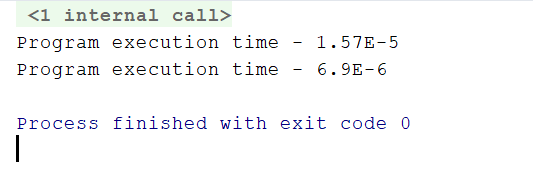

# Memory optimization
Source code in Java:
```Java
int[][] MB = new int[10][10];
        int res = 0;
        for (int i = 0; i < 10; i++) {
            for (int j = 0; j < 10; j++) {
                MB[j][i]++;
            }
        }
```    
Next changes were implemented:

> adding row variable to pool of variables

Result:
```Java
int[][] MB1 = new int[10][10];
       int[] row;
       for (int i = 0; i < 10; i++) {
           row = MB[i];
           for (int j = 0; j < row.length; j++) {
               row[j]++;
           }
       }
``` 


Execution time was reduced due to **lowering number of times variable 'i' was called**.

